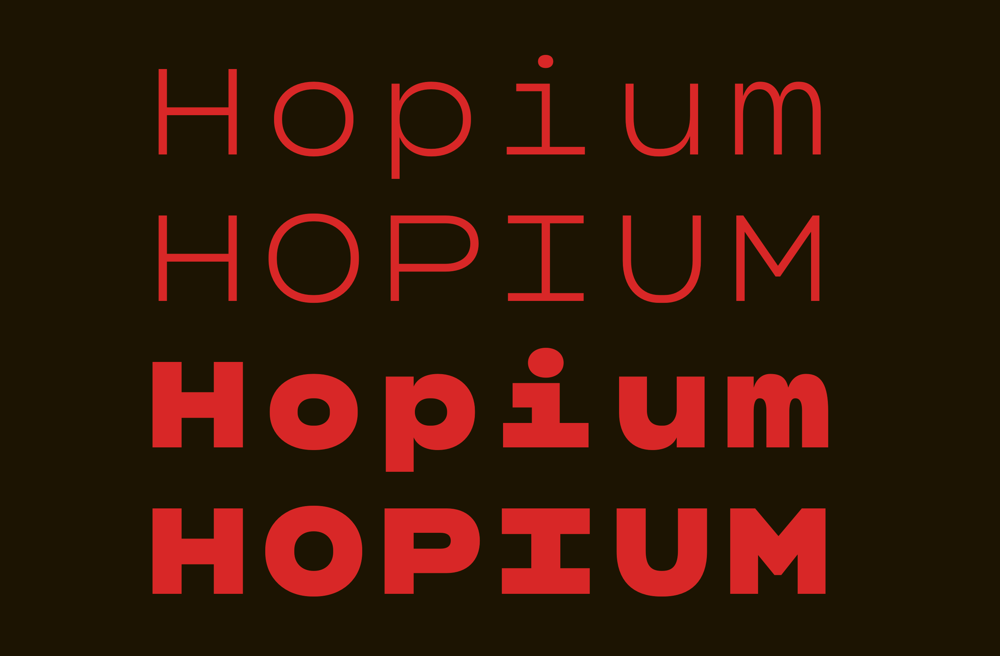
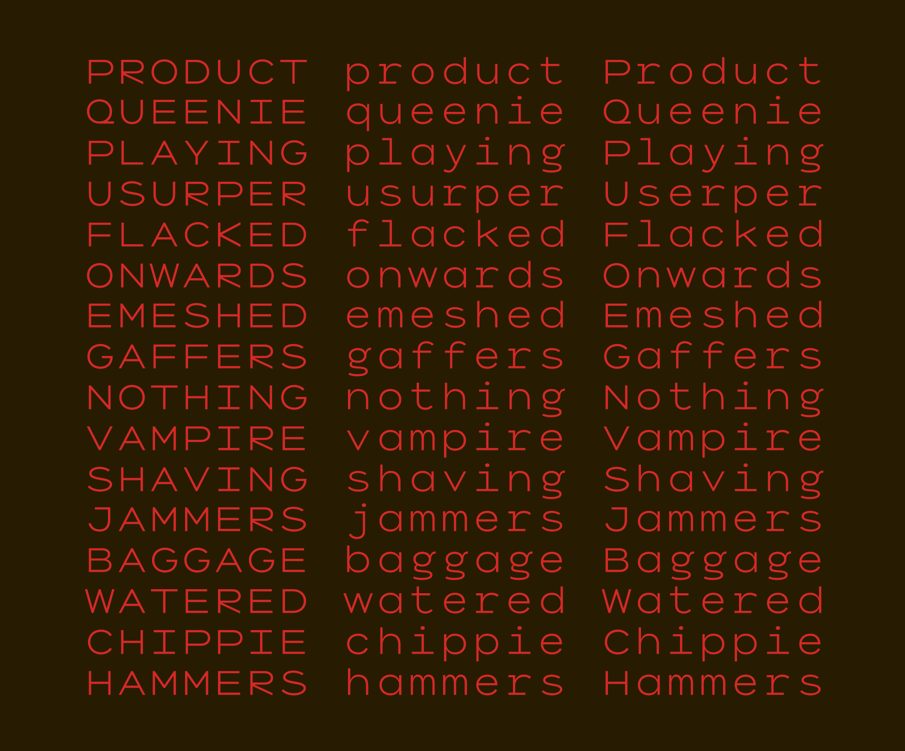

# Hopium

_Hopium_ is a monospace sans serif designed for display use. 

The design of _Hopium_ was inspired by the on stage displays used by the band _Massive Attack_ in August 2026.

## About the Designer

[David Sargent](https://davidsargent.com.au) is an Australian designer and educator living and working on Jagera and Turrbal land. 

He is Creative Director of [Liveworm](https://liveworm.com.au), a work-integrated learning incubator within the [Queensland College of Art & Design, Griffith University](https://www.griffith.edu.au/arts-education-law/queensland-college-art-design). Liveworm operates as a working design studio for students to engage with a broad range of ‘real world’ projects for not-for-profit, cultural, educational, and small to medium commercial clients. 

As a design practitioner, David is interested in how creative practice can engage, communicate, and spark social change. His studio practice focuses on typography, expressive lettering, and disruptive augmented reality, with creative works exhibited in Australian and international galleries. He releases typefaces under the moniker [Bolt Cutter Type](https://boltcuttertype.com).
      

## Changelog

**August 2026. Version 0.1**
* Initial upload of some letterforms (proof of concept)

## License

This Font Software is licensed under the SIL Open Font License, Version 1.1.
This license is available with a FAQ at
https://scripts.sil.org/OFL

## Repository Layout

This font repository structure is inspired by [Unified Font Repository v0.3](https://github.com/unified-font-repository/Unified-Font-Repository), modified for the Google Fonts workflow.
